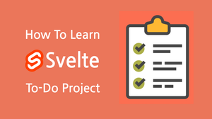

# svelte-tutoral-basic-example

'만들면서 배우는 svelte' 강좌에서 사용한 예제들 입니다. 

추가로 todo 예제의 경우 아래 링크를 참조하세요.

# todo basic
https://github.com/freeseamew/todo-svelte-basic

# todo store
https://github.com/freeseamew/todo-svelte-store

